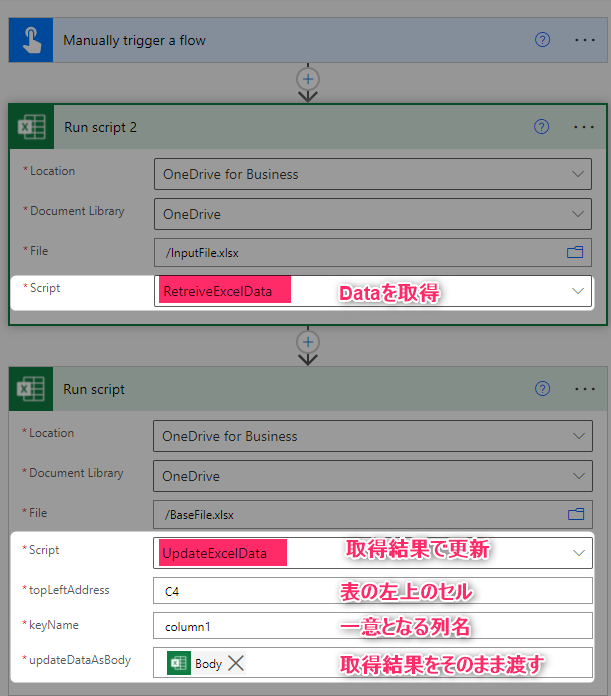

# 概要
Excel データを Office Scripts で更新

# 使い方
1. firstCellName に取得対象の左上のセル名を設定
1. Power Automate からCallすれば、Body をそのまま UpdateExcelData に渡せばOK

# Office Scripts について
## RetreiveExcelData.osts
- 更新データの取得
- JSON で取得結果を返す。
    - 現状、JSON/object で返すと使いやすいけど、引数が無効化されるため、topLeftAddress をソース内設定としている。[詳細はここで](https://qiita.com/baku2san/items/05a3c10893069da453a8) 

|引数|説明|例|
|-|-|-|
|(topLeftAddress)|本来引数で渡したいところだが、object/JSON を Retrun で設定する場合、引数が無効になる為、現状はソース内設定としている。|C4|

## UpdateExcelData.osts
- 更新データを元に以下実施
    - 存在しない KeyName の行は追加
    - 存在する Keyname の行は、更新
    - ColumnName が更新側にない場合は無視

### 注意
- KeyName は複合キー未対応
- ColumnName が更新側にない場合に列追加したい場合は編集必要
- 最終行をもとに書式コピーしてあるので、最終行が表外の場合は修正必要（コピー自体も問題になるが）

|引数|説明|例|
|-|-|-|
|topLeftAddress|更新対象の左上のセル名|C4|
|keyName|一意に行を判断する列名|column1|
|updateDataAsBody|更新対象となるData|@{body('Run_script_2')}|
